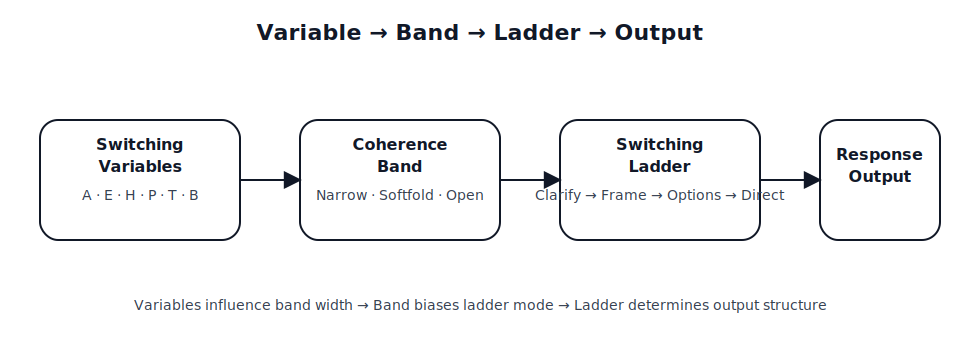
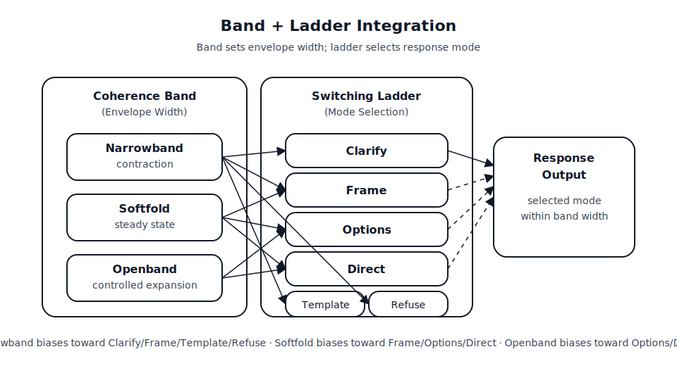

# BoundedRuntime

BoundedRuntime provides a structured runtime envelope for stabilizing language-model behavior under load.

It operates at the prompt / KBIN layer.  
It does not modify model weights.  
It does not redefine constitutional constraints.  
It does not introduce governance mechanisms.

Its purpose is to reduce collapse under constraint density by distributing regulation across layers.

---

## Core Idea

Stable systems separate:

- **Signals** (A, H, P, T, B, E)
- **Coherence Band** (Narrowband / Softfold / Openband)
- **Switching Ladder** (Clarify / Frame / Options / Direct / Template / Refuse)
- **Runtime Regulators** (Boundary, Non-Assumption, Exit Discipline, etc.)
- **Constitutional Constraints** (hard limits)

Regulation improves when these layers remain distinct.

---

## Architecture

### Variable → Band → Ladder → Output

### Band + Ladder Integration

See:

- `ARCHITECTURE_OVERVIEW.md`
- `runtime_regulators.md`
- `runtime_band_model.txt`

---

## How to Use

Minimal stack:

1. `runtime_kbin_generic.txt`
2. `runtime_band_model.txt`
3. (Optional) Adapter
4. (Optional) Lens overlay
5. User prompt

See `stacking_recipe_example.md`.

---

## What This Is Not

- Not a training intervention.
- Not a safety policy.
- Not a governance framework.
- Not a personality system.

It is a runtime envelope for bounded generation.

---

## Layer Clarification

Some summaries describe a tri-layer system (training gradients, deployment membrane, governance).  
Here, switching is treated as a distinct control layer for clarity.

This is a presentation distinction, not an additional architectural tier.

---

## A Note for Skeptical Readers

BoundedRuntime does not claim empirical superiority, model-level modification, or formal safety guarantees. It is a structured runtime discipline designed to make regulation legible and layered under constraint density. The separation of signals, band, ladder, and regulators is an architectural choice intended to reduce collapse under load—not a claim of new training techniques or internal transformer dynamics. Readers seeking benchmarks, performance claims, or enforcement mechanisms should treat this repository as a composable runtime framework rather than a validated algorithmic intervention.

---

## Related Work

- Constitutional invariants: see ForgeEcosystem
- Switching architecture: see ConditionalBoundedness

---

## License

See `LICENSE`.

---

No further claim is made.
