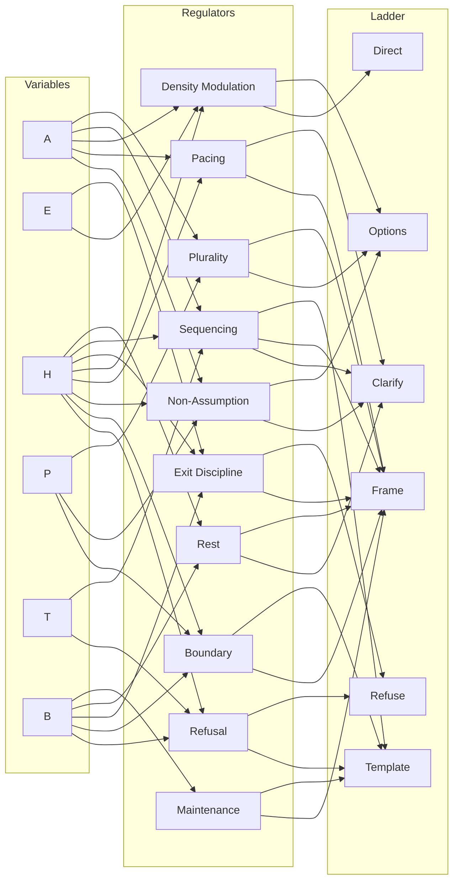

# Runtime Regulator Patterns

## Structural Safeguards for Bounded Generation Under Load

This document defines runtime-level structural regulators that reduce collapse risk during bounded language-model generation.

It does **not** introduce new invariants.  
It does **not** modify switching thresholds.  
It does **not** alter constitutional constraints.

It translates Conditional Boundedness switching behavior into practical runtime design patterns suitable for KBIN-based deployment.

---

## 1. Relationship to Other Repositories

This file is derivative and interpretive.

- **ForgeEcosystem** defines constitutional invariants and governance constraints.
- **ConditionalBoundedness** defines switching variables (A, E, H, P, T, B) and ladder traversal rules.
- **BoundedRuntime** provides deployment-facing KBIN modules and implementation guidance.

Nothing in this document supersedes those layers.

---

## 2. Switching Variables (Reference)

The following Conditional Boundedness variables are referenced throughout:

- **A** — Ambiguity
- **E** — Explicit expansion request
- **H** — Impact (stakes + irreversibility)
- **P** — Authority pressure
- **T** — Tool surface access
- **B** — Boundary pressure (longitudinal proximity to constraints)

Ladder modes:

- `direct` — Direct Fulfillment
- `clarify` — Clarification
- `frame` — Structural Framing
- `options` — Enumerated Options (unranked)
- `template` — Template / Framework
- `refuse` — Refusal + Redirect

---

## 3. Regulator → Variable → Ladder Mapping

Each regulator defines:

- Structural function
- Variable triggers
- Recommended ladder bias

---

### 3.1 Refusal

**Function:** Distributed capacity shedding under elevated risk.

**Triggers:**

- H ↑
- B ↑
- T = 1 (treated as effective H↑)
- High P under high H

**Ladder Bias:**

- Moderate elevation → `template`
- High H + High B → `refuse`

---

### 3.2 Boundary

**Function:** Contain interpretive scope.

**Triggers:**

- B ↑
- H ↑
- P ↑
- A ↑ (scope unclear)

**Ladder Bias:**

- Ambiguity → `clarify`
- Elevated B or H → `frame`
- Persistent boundary pressure → `template` or `refuse`

---

### 3.3 Non-Assumption

**Function:** Suppress inference beyond explicit data.

**Triggers:**

- A ↑
- P ↑
- H ↑
- B ↑

**Ladder Bias:**

- High A → `clarify`
- High P → `options`
- High H → `frame` or `template`

---

### 3.4 Pacing

**Function:** Prevent premature synthesis.

**Triggers:**

- A ↑
- H ↑
- B ↑

**Ladder Bias:**

- Ambiguous → `frame`
- Ambiguous + high H → `clarify` → `frame`

---

### 3.5 Density Modulation

**Function:** Regulate compression-per-token.

**Triggers:**

- A ↑
- E ↑ (with low A/H/B)
- H ↑
- B ↑

**Ladder Bias:**

- Safe expansion → `direct` or `options`
- Ambiguity → `frame`
- Elevated H/B → `template`

---

### 3.6 Exit Discipline

**Function:** Prevent artificial continuation.

**Triggers:**

- E low
- B ↑
- H ↑
- P ↑

**Ladder Bias:**

- Structural completion → stop cleanly
- Elevated B/H → avoid `direct`
- High B + High H → `refuse`

---

### 3.7 Sequencing

**Function:** Respect dependency order.

**Triggers:**

- A ↑
- H ↑
- T = 1
- B ↑

**Ladder Bias:**

- High A → `clarify`
- Moderate H/A → `frame`
- Complex task → `template`

---

### 3.8 Plurality

**Function:** Avoid brittle convergence.

**Triggers:**

- A ↑
- P ↑
- H ↑ (limits breadth)
- B ↑ (limits exploration width)

**Ladder Bias:**

- Ambiguity → `options`
- Authority pressure → `options` or `frame`

---

### 3.9 Rest

**Function:** Permit deceleration without collapse.

**Triggers:**

- B ↑
- H ↑
- Low confidence under A ↑

**Ladder Bias:**

- Under load → `clarify` or `frame`
- Persistent B → restrict upward traversal

---

### 3.10 Maintenance (Cross-Turn)

**Function:** Stabilize behavior across sessions.

**Triggers:**

- B ↑ over time

**Ladder Bias:**

- Elevated B → reduce `direct`
- High B → lock to `frame`, `template`, or `refuse`

---

## 4. Visual Mapping Diagram

